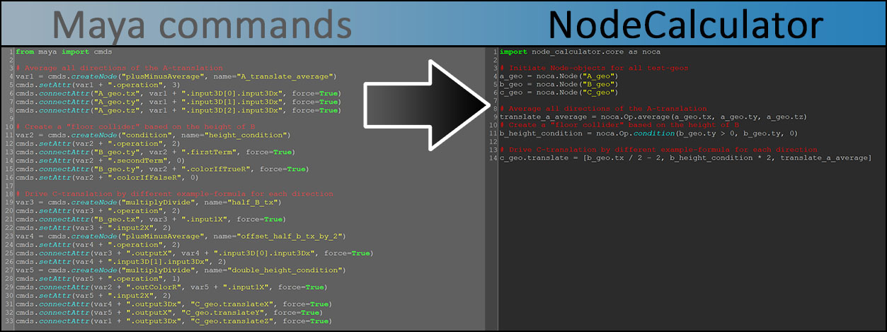

Welcome to the NodeCalculator documentation!
==============================================================================

The NodeCalculator is an OpenSource Python module that allows you to create node networks in Autodesk Maya by writing math formulas.

.. toctree::
   :maxdepth: 3
   :caption: Contents:

   about
   download
   tutorial
   code

Overview
------------------------------------------------------------------------------

* :ref:`genindex`
